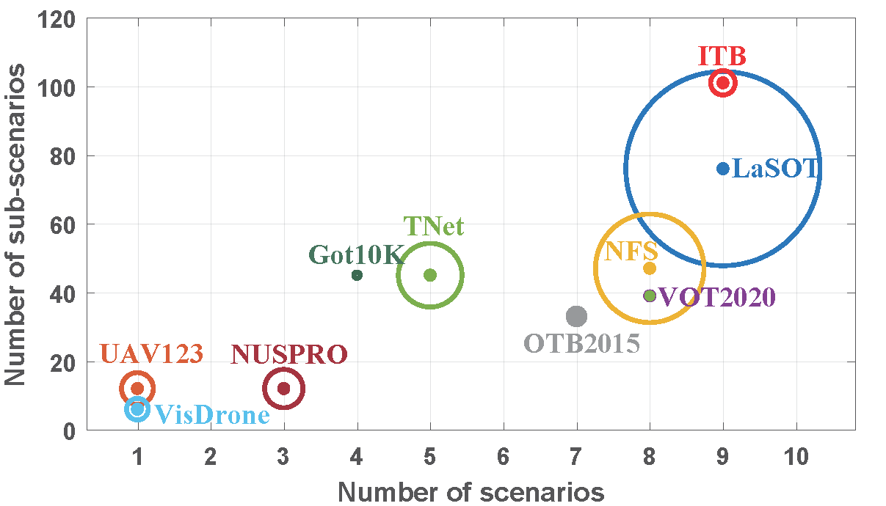
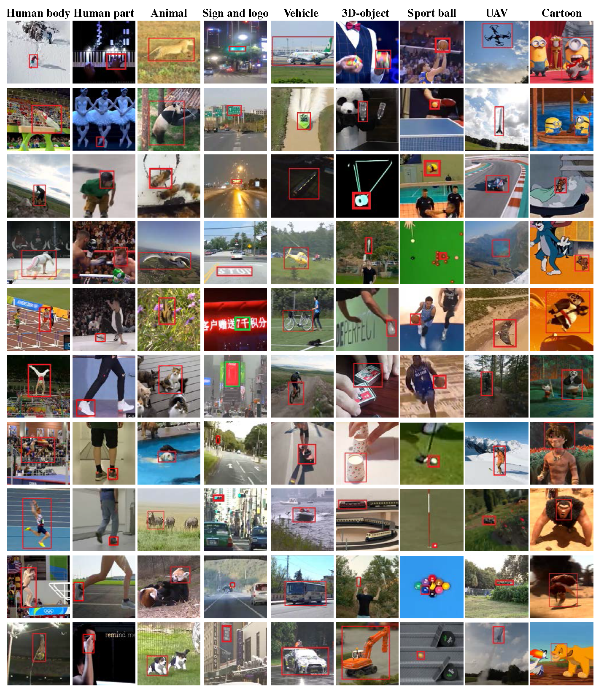
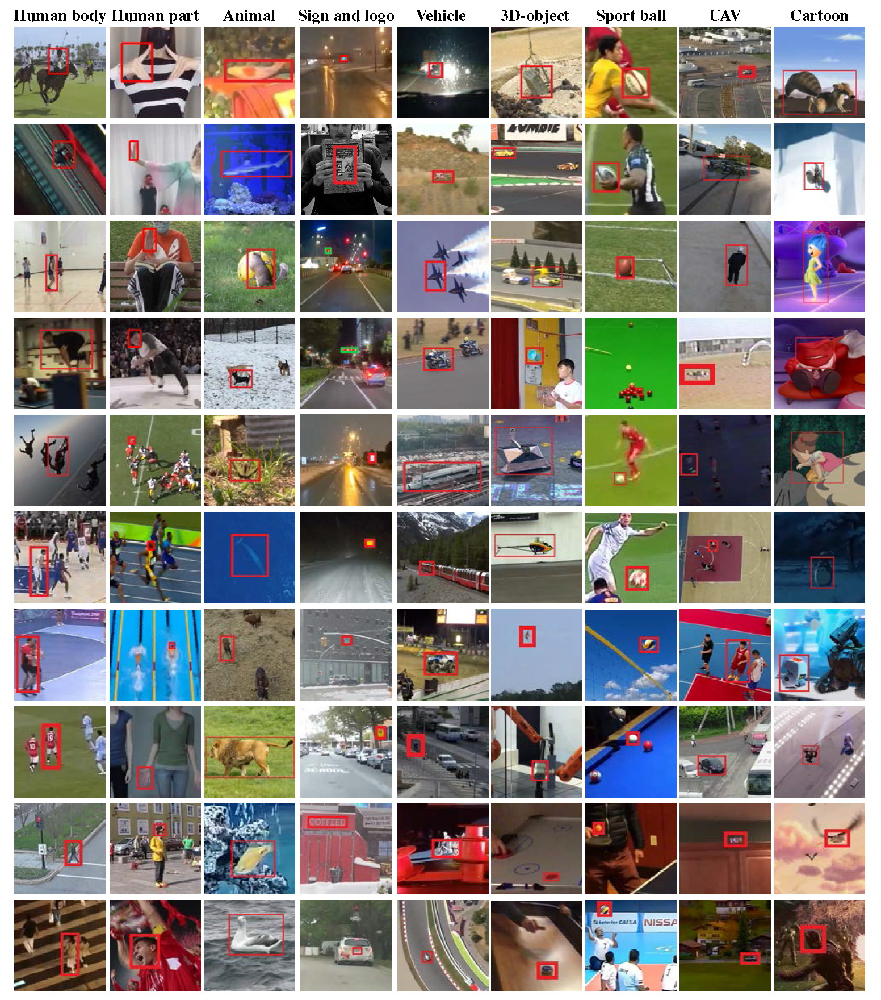

# Informative-tracking-benchmark
Informative tracking benchmark (**ITB**) 
* **higher diversity**. It contains 9 representative scenarios and 180 diverse videos. 
* **more effective**. Sequences are carefully selected based on chellening level, discriminative strength, and density of appearance variations. 
* **more efficient**. It is constructed with 7\% out of 1.2 M frames allows saving 93\% of evaluation time (3,625 seconds on informative benchmark vs. 50,000 seconds on all benchmarks) for a real-time tracker (24 frames per second). 
* **more rigorous comparisons**. (All the baseline methods are re-evaluated using the same protocol, e.g., using the same training set and finetuning hyper-parameters on a specified validate set).


<!--
> **Informative Tracking Benchmark**, Xin Li, Qiao Liu, Wenjie Pei, Qiuhong Shen, Yaowei Wang, Huchuan Lu, Ming-Hsuan Yang 
> **[[Paper]()] [[Project]()] [[DemoVideo](https://www.youtube.com/watch?v=U4uUjci9Gjc)] [[VideoTutorial]()]** 
-->

## News: 
* 2021.12.09 The informative tracking benchmark is released. 


## Introduction 
Along with the rapid progress of visual tracking, existing benchmarks become less informative due to redundancy of samples and weak discrimination between current trackers, making evaluations on all datasets extremely time-consuming. Thus, a small and informative benchmark, which covers all typical challenging scenarios to facilitate assessing the tracker performance, is of great interest. In this work, we develop a principled way to construct a small and informative tracking benchmark (ITB) with 7\% out of 1.2 M frames of existing and newly collected datasets, which enables efficient evaluation while ensuring effectiveness. Specifically, we first design a quality assessment mechanism to select the most informative sequences from existing benchmarks taking into account 1) challenging level, 2) discriminative strength, 3) and density of appearance variations. Furthermore, we collect additional sequences to ensure the diversity and balance of tracking scenarios, leading to a total of 20 sequences for each scenario. By analyzing the results of 15 state-of-the-art trackers re-trained on the same data, we determine the effective methods for robust tracking under each scenario and demonstrate new challenges for future research direction in this field. 

## Dataset Samples 
  

## Dataset Download (8.15 GB) and Preparation
[[**GoogleDrive**](https://drive.google.com/drive/folders/1128vRsweiS5BuOyFbtOAJ6kgXSR5Juj7?usp=sharing)] 
[[**BaiduYun (Code: intb)**](https://pan.baidu.com/s/1gru7Bl-8VztWkodhqA1a1g)] 

After downloading, you should prepare the data in the following structure:
```
ITB
 |——————Scenario_folder1
 |        └——————seq1
 |        |       └————xxxx.jpg
 |        |       └————groundtruth.txt
 |        └——————seq2
 |        └——————...
 |——————Scenario_folder2
 |——————...
 └------ITB.json
 ```
Both txt and json annotation files are provided. 

## Evaluation ToolKit 
The evaluation tookit is wrote in python. We also provide the interfaces to the pysot and pytracking tracking toolkits.

You may follow the following steps to evaluate your tracker.

**1. Download this project:**
    
    git clone git@github.com:XinLi-zn/Informative-tracking-benchmark.git

**2. Run your method:**
     * **base interface**
     * **pytracking interface**
     * **pysot interface**
     
**3. Compute the performance score:**
 
**4. Run the script "Evaluate_VisEvent_SOT_benchmark.m" for computing the performance score**


## Acknowledgement
We select several sequences with the hightest quality score (defined in the paper) from existing tracking datasets including OTB2015, NFS, UAV123, NUS-PRO, VisDrone, and LaSOT. Many thanks to their great work!
* [OTB2015 ] Object track-ing benchmark. Yi Wu, Jongwoo Lim, and Ming-Hsuan Yang. IEEE TPAMI, 2015.
* [   NFS  ] Need for speed: A benchmark for higher frame rate object tracking. Kiani Galoogahi, Hamed and Fagg, et al. ICCV 2017.
* [ UAV123 ] A benchmark and simulator for uav tracking. Mueller, Matthias and Smith, Neil and Ghanem, Bernard. ECCV 2016.
* [NUS-PRO ] Nus-pro: A new visual tracking challenge. Annan Li, Min Lin, Yi Wu, Ming-Hsuan Yang, Shuicheng Yan. PAMI 2015.
* [VisDrone] Visdrone-det2018: The vision meets drone object detection in image challenge results. Pengfei Zhu, Longyin Wen, et al. ECCVW 2018.
* [  LaSOT ] Lasot: A high-quality benchmark for large-scale single object tracking. Heng Fan, Liting Lin, et al. CVPR 2019.

## Contact
If you have any questions about this benchmark, please feel free to contact Xin Li at xinlihitsz@gmail.com.

<!--
## More Related Materials 
* [**Github-1**] https://github.com/wangxiao5791509/SNN_CV_Applications_Resources 
* [**Github-2**] https://github.com/uzh-rpg/event-based_vision_resources 
* [**Github-3**] https://github.com/wangxiao5791509/Single_Object_Tracking_Paper_List
* [**Survey**] **神经形态视觉传感器的研究进展及应用综述**，计算机学报，李家宁, 田永鸿 [[Paper](https://drive.google.com/file/d/1d7igUbIrEWxmUI7xq75P6h_I4H7uI3FA/view?usp=sharing)] 
* [**Survey**] **Event-based Vision: A Survey**, Guillermo Gallego, et al., IEEE T-PAMI 2020, [[Paper](https://arxiv.org/abs/1904.08405)]
* [**FE108 dataset**] **Object Tracking by Jointly Exploiting Frame and Event Domain**, Jiqing Zhang, et al., ICCV 2021, [[Project](https://zhangjiqing.com/dataset/)] [[DemoVideo](https://www.youtube.com/watch?v=EeMRO8XVv04&ab_channel=JiqingZhang)] [[Github](https://github.com/Jee-King/ICCV2021_Event_Frame_Tracking)] [[Dataset](https://zhangjiqing.com/dataset/contact.html)] [[Paper](https://arxiv.org/pdf/2109.09052.pdf)]
* [**SpikingJelly**] (SpikingJelly is an open-source deep learning framework for Spiking Neural Network (SNN) based on PyTorch) [[OpenI from PCL](https://git.openi.org.cn/OpenI/spikingjelly)] [[GitHub](https://github.com/fangwei123456/spikingjelly)] [[Documents](https://spikingjelly.readthedocs.io/zh_CN/latest/)]
* [**Event-Toolkit**] https://github.com/TimoStoff/event_utils (Various representations can be obtained with (a) the raw events, (b) the voxel grid, (c) the event image, (d) the timestamp image.)

 


## :page_with_curl: BibTex: 
If you find this work useful for your research, please cite the following papers: 

```bibtex
@article{wang2021viseventbenchmark,
  title={VisEvent: Reliable Object Tracking via Collaboration of Frame and Event Flows},
  author={Xiao Wang, Jianing Li, Lin Zhu, Zhipeng Zhang, Zhe Chen, Xin Li, Yaowei Wang, Yonghong Tian, Feng Wu},
  journal={arXiv:2108.05015},
  year={2021}
}
```
-->


